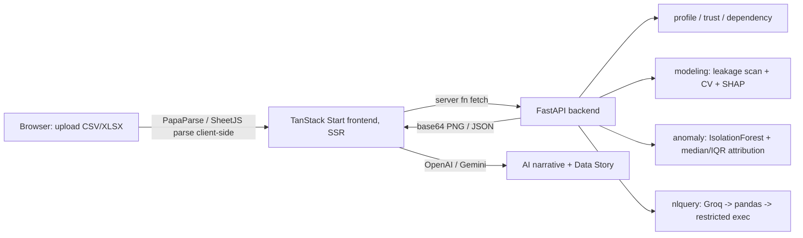

# InsightFlow

[](#)
[](#)
[](#)
[](#)
[](#)
[](#)
[](#)

> **AI-assisted tabular data-intelligence platform.** Upload a spreadsheet and get a profiled, trust-scored, leakage-aware analysis: honest cross-validated modeling, SHAP explanations, multivariate anomaly detection, and a grounded natural-language query interface.

InsightFlow turns a raw CSV/XLSX into a decision-ready analysis. Its design goal is **rigor over flash**: every analytical number is computed in Python. The LLM is used in exactly two narrow places (narrating already-computed facts, and translating a question into auditable pandas code). It never invents a finding or a metric.

---

## Governing principle

**Every analytical output is computed deterministically in Python. The LLM only narrates computed results or emits code that is shown to the user before it runs.**

This is the core differentiator and the reason the analysis is defensible:

- The **Data Story / narrative** is generated from a JSON dict of already-computed facts. The model is asked to summarize, not to analyze.
- The **NL query** feature asks the LLM to return pandas code assigning to `result`. The generated code is displayed prominently and executed in a restricted namespace. The model produces the *query*, the data produces the *answer*.

---

## What it does (current, working)

| Capability | How it works |
| --- | --- |
| **Dataset profiling** | Per-column dtype, missing %, uniqueness, and for numerics mean/median/min/max/std + IQR outlier counts. |
| **Trust Score** | Transparent weighted composite with a per-component breakdown (completeness, validity, consistency, etc.). Value *and* breakdown are returned, not a black-box number. |
| **Dependency analysis** | Pearson + Spearman + mutual information matrices for two heatmaps (linear, monotonic, and predictive dependency). |
| **Target suitability (pre-flight)** | Before training: completeness, variance, class-balance, and a sample-size heuristic (labeled as a heuristic, not a law). |
| **Feature recommendations** | Buckets features into `high_signal` / `low_signal` / `harmful` / `leakage` from leakage flags + model importance, shown before training. |
| **Leakage-safe modeling** | Leakage scan (single-feature CV score + structural giveaways), then a **curated 2-model** comparison (linear/logistic baseline + HistGradientBoosting). All preprocessing lives inside an sklearn `Pipeline`/`ColumnTransformer` so it refits per CV fold. Reports mean ± std across folds. Not a leaderboard. |
| **Class-imbalance guard** | Warns that accuracy is misleading when the majority class share exceeds 0.8. |
| **SHAP explainability** | Reuses the trained best model (no retraining). Global importance (bar) + a per-row waterfall, rendered server-side as PNGs. |
| **Anomaly detection** | Isolation Forest on the preprocessed matrix → per-row score. Top-3 drivers attributed by **standardized deviation from each column's robust center (median/IQR)**, not SHAP. |
| **NL query → executed pandas** | Schema string → Groq returns pandas code → executed in a restricted namespace exposing only `{df, pd, np}` and empty builtins. Both code and result are returned and shown. |
| **AI narrative + Data Story** | LLM (OpenAI or Gemini) composes a Summary / Key Findings / Risks / Recommendations narrative from computed facts. |
| **PDF export** | Client-side report export via jsPDF. |

> **Roadmap (not yet implemented):** user-defined calculated columns, a custom chart builder, clean-dataset + reproducible-code export, persisted analysis history (SQLite), and format/functional-dependency constraint mining. See [Roadmap](#roadmap).

---

## Architecture

InsightFlow is a two-process app. A TanStack Start (React 19, SSR) frontend serves the UI and exposes **server functions** that proxy to a separate FastAPI backend where all analysis runs.



Key facts:

- **File parsing is client-side.** The frontend parses CSV/XLSX into a column-oriented dict and sends that to the backend. There is no `/upload` endpoint; the data travels in request bodies.
- **The frontend server functions are thin proxies.** Core logic is not duplicated in TypeScript; it lives only in `backend/src/*.py`.
- **Backend session state is in-memory.** Fitted models and DataFrames are held in module-level dicts keyed by `session_id`. There is no database and no persistence across restarts. See [Known limitations](#known-limitations).
- **Two LLM providers in two places:** Groq (backend, NL query) and OpenAI/Gemini (frontend SSR, narrative + Data Story).

---

## Tech stack

| Layer | Technologies |
| --- | --- |
| Frontend | React 19, TanStack Start (SSR) + TanStack Router + React Query, Tailwind CSS v4, shadcn/ui (Radix), Recharts, jsPDF |
| Frontend file parsing | PapaParse (CSV/TSV), SheetJS / `xlsx` (Excel) |
| Backend | FastAPI, Uvicorn, Python 3.10+ |
| Analysis | pandas, NumPy, scikit-learn, SHAP, Matplotlib |
| LLM | Groq (NL query, backend), OpenAI or Gemini (narrative + Data Story, frontend SSR) |
| Auth (scaffolded) | Supabase client + bearer-token middleware (present, **not currently enforced** on any route) |
| Build / deploy target | Vite + `@cloudflare/vite-plugin`, Wrangler (Cloudflare Workers) |

---

## Backend API

All analysis endpoints are keyed by a `session_id` generated client-side on upload.

| Method | Endpoint | Purpose |
| --- | --- | --- |
| `POST` | `/analyze/{session_id}` | Start background profiling + trust + dependency. |
| `GET`  | `/analyze/{session_id}` | Poll analysis job status / result. |
| `POST` | `/suitability/{session_id}` | Target suitability pre-flight check. |
| `POST` | `/recommend/{session_id}` | Feature recommendation buckets. |
| `POST` | `/model/{session_id}` | Leakage-safe CV modeling; returns task, leakage flags, per-model metrics (mean ± std), best model. |
| `POST` | `/shap/{session_id}` | SHAP global + per-row waterfall PNGs (reuses trained model). |
| `GET`  | `/anomaly/{session_id}` | Ranked anomalous rows with top-3 deviation drivers. |
| `POST` | `/query/{session_id}` | NL question → generated pandas code + executed result. |
| `GET`  | `/health` | Liveness check. |

---

## Getting started

### Prerequisites

- Node.js 20+ (or Bun)
- Python 3.10+
- A **Groq** API key (for NL query)
- An **OpenAI** or **Gemini** API key (for the narrative + Data Story)

### 1. Clone

```bash
git clone https://github.com/mythribanda/InsightFlow.git
cd InsightFlow
```

### 2. Backend (FastAPI)

```bash
cd backend
python -m venv .venv
source .venv/bin/activate          # Windows: .venv\Scripts\activate
pip install -r requirements.txt

# NL query needs a Groq key. Put it in backend/.env or export it:
export GROQ_API_KEY=your_groq_key

# Run with a SINGLE worker (in-memory session state is per-process):
uvicorn main:app --host 0.0.0.0 --port 8000
```

### 3. Frontend (TanStack Start)

From the repo root:

```bash
bun install            # or: npm install

# Create .env at the repo root:
#   MODELING_API_URL=http://localhost:8000      # where the backend lives
#   OPENAI_API_KEY=your_openai_key              # OR set GEMINI_API_KEY instead
# Optional AI overrides:
#   AI_API_KEY=...        AI_API_ENDPOINT=...    AI_MODEL=...

bun run dev            # or: npm run dev   (Vite dev server on :8080)
```

### 4. Use it

1. Open the app in your browser.
2. Drag in `demo-employee-data.csv` (400 rows: `employee_id, name, age, experience, department, city, rating, salary`).
3. Review the dashboard: shape, trust score + breakdown, profile table, dependency heatmaps.
4. Open the Modeling Studio: pick a target (e.g. `salary` for regression, `department` for classification), review suitability + feature recommendations + leakage flags, then train and read the mean ± std CV metrics and SHAP plots.
5. Open the Anomaly tab to see flagged rows with their driving columns.
6. Ask a question in the query box (e.g. "top 5 rows by salary") and inspect the generated pandas code before the result.
7. Generate the Data Story and export a PDF.

---

## Environment variables

| Variable | Where | Required | Purpose |
| --- | --- | --- | --- |
| `GROQ_API_KEY` | Backend | Yes (for `/query`) | NL → pandas code generation. |
| `MODELING_API_URL` | Frontend (SSR) | Yes in prod | URL of the FastAPI backend. Defaults to `http://localhost:8000`. |
| `OPENAI_API_KEY` | Frontend (SSR) | One of these | Narrative + Data Story via OpenAI. |
| `GEMINI_API_KEY` | Frontend (SSR) | One of these | Narrative + Data Story via Gemini (OpenAI-compatible endpoint). |
| `AI_API_KEY` / `AI_API_ENDPOINT` / `AI_MODEL` | Frontend (SSR) | Optional | Override the AI provider/endpoint/model. |

Never commit real keys. `.env` is gitignored.

---

## Known limitations

Stated plainly, because they matter for evaluation and deployment:

- **No persistence.** Sessions, fitted models, and DataFrames live in in-memory dicts. A backend restart loses all state. There is no database.
- **Single-process only.** Because state is in-process, the backend must run with a **single** Uvicorn worker. Running `--workers N > 1` will break sessions.
- **The NL-query sandbox is a guard, not a real sandbox.** Code runs with restricted builtins and a limited namespace. Do not expose `/query` publicly without a real sandbox.
- **Supabase auth is scaffolded but not enforced.** The bearer-token middleware exists but is not applied to any route. Treat the app as unauthenticated.
- **CORS is wide open** (`allow_origins=["*"]`) for local development.

---

## Roadmap

Planned, not yet implemented (each is specified in the build-prompt docs in the repo):

- **Calculated columns** — a safe expression evaluator (`df.eval`-based, whitelisted `IF/ROUND/ABS/AVG/SUM/COUNT`) that adds a derived column into the live session so it flows into profiling and modeling.
- **Custom chart builder** — x/y/type/agg dropdowns rendering via Recharts alongside the auto charts.
- **Clean-dataset + reproducible-code export** — download the cleaned CSV (recommendations applied) and a standalone `.py` script that reproduces the preprocessing + a few charts.
- **Analysis history** — SQLite persistence so past runs survive a restart and can be re-opened read-only.
- **Constraint mining** — per-column format detection and approximate functional-dependency discovery, feeding the Trust Score consistency component.
- **Backend Data Story + weasyprint report** — moving narrative generation fully server-side from a computed-facts JSON, with a richer PDF.

---

## Project structure

```
InsightFlow/
├── backend/
│   ├── main.py                  # FastAPI app + all endpoints
│   ├── requirements.txt
│   └── src/
│       ├── profile.py           # per-column profiling
│       ├── trust.py             # weighted trust score + breakdown
│       ├── dependency.py        # Pearson / Spearman / mutual information
│       ├── modeling.py          # task detection, leakage scan, leakage-safe CV
│       ├── modeling_extensions.py  # suitability, feature rec, SHAP plots
│       ├── anomaly.py           # IsolationForest + median/IQR attribution
│       └── nlquery.py           # Groq -> pandas -> restricted exec
├── src/                         # frontend (TanStack Start)
│   ├── routes/index.tsx         # main dashboard + tabs
│   ├── server/                  # server fns proxying to the backend
│   │   ├── analysis.ts  modeling.ts  anomaly.ts  query.ts
│   ├── components/              # AutoCharts, ModelingPanel, AnomalyPanel, QueryBox, ...
│   ├── lib/                     # parseFile, profiler, exportReport, riskLevel
│   ├── utils/ai.functions.ts    # OpenAI/Gemini narrative + Data Story
│   └── integrations/supabase/   # client + (unused) auth middleware
├── demo-employee-data.csv
├── InsightFlow_Implementation_Spec.md
├── InsightFlow_Spec_Addendum.md
└── README.md
```

---

## License

MIT.

## Author

**Mythri Banda** 